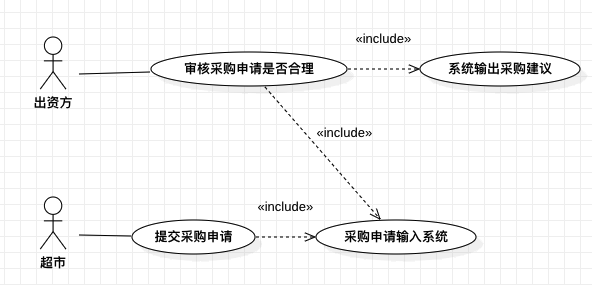
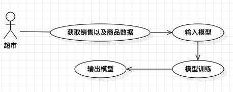
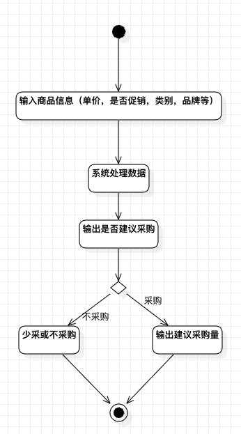
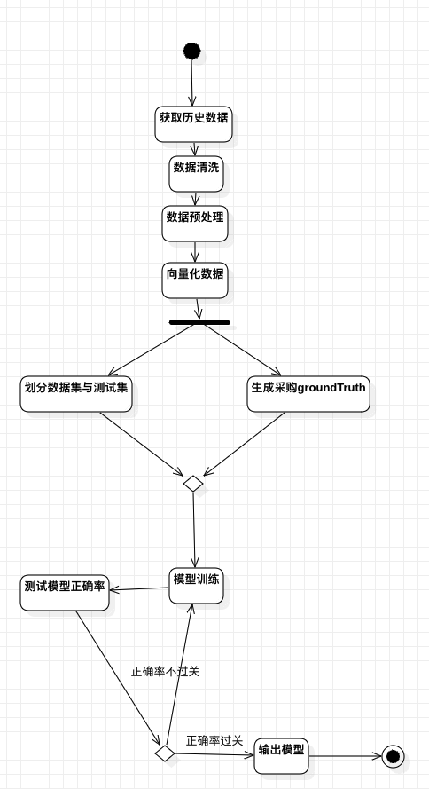

# 商品决策文档

> @Version 0.0.1  
> @author SHK  
>

## 1. 系统描述
## 1.1 系统输入
+ 历史总销售数据
  > + 库存
  > + 进价
  > + 售价
  > + 折扣
  > + 进货数量
  > + 售出数量
  > + 毛利率
  > + 期初数量
  > + 期末数量
  > + ...
+ 历史门店销售数据
+ 门店地理位置
+ 商品(单品)信息
  > + 商品类别
  > + 品牌
  > + ...

## 1.2 系统输出
+ 输出采购建议
  > + 采购
  > + 不采购
  > + ...
+ 细化建议数值

## 2. 模型选择

根据数据规模以及所需输出综合考虑,目前备选模型
### 2.1 决策树
> 1. 决策树
> 1. 随机森林
> 1. XGBoost
> 1. ...
>

#### 优点

+ 良好的可解释性
+ 数据拟合性好
+ 训练速度相对较快
+ ...

#### 缺点
+ 对于带有新类型的数据需要重新学习
+ 容易过拟合
+ ...

### 2.2 贝叶斯网

用以学习那些因素与采购建议相关
> 1. 带隐参数的贝叶斯网
>> ps: 其中,隐参数表示现实世界中会影响输出但暂时没有在数据中出现的随机变量

#### 优点
+ 良好的可解释性
+ 以概率的形式描述采购环节中的各随机变量之间的关系,对于每一个随机变量都可以通过获取学习好的条件概率表来计算在各种特殊情况下的采购建议
+ ...

#### 缺点
+ 传统的爬山法训练速度慢,尤其是当随机变量数量以及随机变量的取值类型多了之后训练速度呈指数倍下降
+ 学术界现有的方法通过深度学习的手段来学习贝叶斯网的做法能够有效增加学习速度,但是学习的准确性有待考证,暂时无法在业界直接使用
+ ...

### 2.3 深度神经网络

此类模型多用于分类任务,此类模型细分种类较多,暂时还没研究
#### 优点
+ 有较多成熟的模型
+ 现成的资料较多,论文也相对多,容易出成果
+ 现成模型通过调参和微调模型结构就能产生输出
+ ...

#### 缺点
+ 基本没啥可解释性
+ 学习模型算力要求高
+ ...

## 3. 系统分析

### 3.1 用例
+ 审核用例
+ 

+ 模型训练用例
+ 
### 3.2 活动

+ 审核活动图
+ 

+ 模型训练活动
+ 
### 3.3 组件
...
### 3.4 类
...

## 4. 数据详情
### 4.1 数据清洗
由各门店以及超市方传来的数据有部分不可用,如数据不完备,某些商品不需要进行预测等.  
为了在训练过程中得到干净可用的数据,需要把错误的,不完备,不需要的数据通过过滤器过滤掉.  
> 过滤条件:
>> 1. ...
>> 2. ...

### 4.2 数据预处理
在训练中,并非所有的数据项都需要使用,因此在此首先删除掉数据集中不需要使用的数据项,生成数据集的子视图.
#### 4.2.1 进销存数据(总表)
#### 4.2.2 门店进货数据
#### 4.2.3 门店销售数据(缺失)

### 4.3 向量化处理
将数据表转换为计算机可理解并使用的向量形式.  
> 转换规则
>> 1. ...
>> 2. ...

### 4.4 数据准备
#### 4.4.1 训练数据与测试数据

#### 4.4.2 GroundTruth生成

